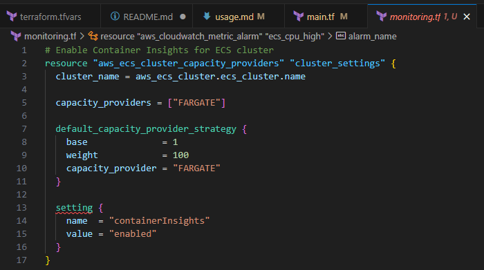
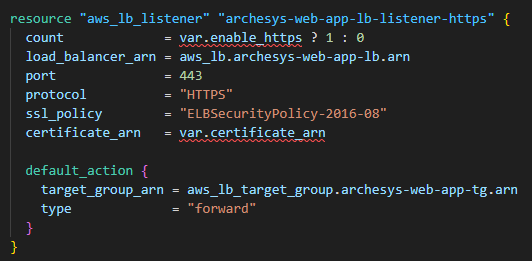

# Amazon Q usage with Terraform

## Overview

This document illustrates results from various test scenarios ranging from simple to advanced use cases.

## Features

- ECS based web service
- ALB frontend for access from the Internet
- RDS Backend
- Nat GW for ECS tasks to reach Internet
- Public subnets for ALb & private subnets for ECS/DB

---
## Summary

- Amazon Q is really good at explaining code and understanding traffic/data flows.
- Code optimization works better with more specific instructions. e.g.- optimize for security.
- Unit test works only for Python & Java. However it generated a test file in GO for my Terraform script
- Code review is great. It identifies issues, provides explanations, and generate fixes as well
- Code generation is really good for sample code. You can use /dev mode to generate context specific code but you will have to verify as it might contain small errors. If it doesn't produce the complete output the first tie you can iteratively ask to improve the code until you get close to the desired output.

---
## Testing - Simple Scenarios

### Explain this code (main.tf) in detail


```
I'll break down this Terraform configuration file that sets up a comprehensive AWS infrastructure. Here's a detailed explanation:

Provider Configuration:

Sets up AWS provider with access credentials and region

Uses variables for sensitive information like access keys

Network Infrastructure:

Creates a VPC with DNS support enabled

Sets up 3 tiers of subnets across 3 availability zones:

Public subnets (for internet-facing resources)

Private subnets (for application components)

DB subnets (for database resources)

Implements networking components:

Internet Gateway for public internet access

NAT Gateway for private subnet internet access

Route tables for traffic management

Load Balancer Configuration:

Creates an Application Load Balancer (ALB)

Sets up target group with health checks

Configures listener for routing traffic

Defines security groups for ALB access

Security Groups:

archesys-web-alb-sg: For the load balancer

archesys-web-app-sg: For the application (ECS tasks)

archesys-web-db-sg: For the database

ECS (Elastic Container Service) Setup:

Creates an ECS cluster

Defines task definition for Fargate:

512 CPU units

1024MB memory

Linux-based container

Sets up ECS service:

Fargate launch type

Load balancer integration

Network configuration in private subnets

Database Configuration:

Creates an RDS Aurora MySQL cluster

Sets up DB subnet group

Configures security and networking

Key Features:

Highly available (spans 3 AZs)

Secure architecture (layered networking)

Container-based application deployment

Managed database service

Load balanced for scalability

The infrastructure follows AWS best practices with:

Separation of concerns (public/private/database tiers)

Proper security group configurations

Managed services usage (RDS, ECS, ALB)

Network isolation for sensitive components

This setup is suitable for running a containerized web application with database backend in a production environment.

```

### How is traffic routed between the public and private subnets in this setup? <-- Q suggested this question as a follow up to the previous question


```
In this setup, traffic routing between public and private subnets is handled through a combination of Internet Gateway (IGW) and NAT Gateway. Here's the detailed traffic flow: [1]

Public Subnet Traffic (Inbound/Outbound): [2]

resource "aws_route_table" "pub_rt" {
    vpc_id = aws_vpc.archesys-web-app-vpc.id
    
    route {
        cidr_block = "0.0.0.0/0"
        gateway_id = aws_internet_gateway.igw.id
    }
}


Public subnets have a route table that directs internet-bound traffic (0.0.0.0/0) to the Internet Gateway

The Application Load Balancer sits in public subnets and can receive traffic directly from the internet

Resources in public subnets can directly communicate with the internet

Private Subnet Traffic (Outbound):

resource "aws_route_table" "pri_rt" {
    vpc_id = aws_vpc.archesys-web-app-vpc.id
    
    route {
        cidr_block = "0.0.0.0/0"
        gateway_id = aws_nat_gateway.nat_gateway.id
    }
}


Private subnets route their internet-bound traffic through the NAT Gateway

The NAT Gateway is placed in the public subnet (specifically public_subnets0)

Traffic flow: Private Instance → NAT Gateway → Internet Gateway → Internet

This allows ECS tasks in private subnets to access the internet (e.g., pulling container images) while remaining secure from direct internet access

Database Subnet Traffic:

resource "aws_route_table" "db_rt" {
    vpc_id = aws_vpc.archesys-web-app-vpc.id
}


Database subnets have no route to the internet

They can only communicate within the VPC through the security group rules

The database security group only allows incoming traffic from the application security group

The overall traffic flow for a typical web request would be:

Internet → Internet Gateway → Load Balancer (in public subnet)

Load Balancer → ECS Tasks (in private subnet)

ECS Tasks → RDS Database (in database subnet)

This architecture ensures that:

Only the load balancer is exposed to the internet

Application containers can access the internet for updates but can't be accessed directly

Database is completely isolated from internet access

```

### Can you optmize this code for security


```
Here's a security-optimized version of the code with best practices for AWS infrastructure security:

Enhanced VPC Configuration:

resource "aws_vpc" "main" {
    cidr_block           = format("%s%s", var.cidr_prefix, ".0.0/16")
    enable_dns_support   = true
    enable_dns_hostnames = true
    
    # Enable VPC flow logs for network monitoring
    enable_flow_log = true
    
    tags = merge(local.common_tags, {
        Name = "${local.prefix}-vpc"
    })
}

# VPC Flow Logs
resource "aws_flow_log" "vpc_flow_log" {
    vpc_id          = aws_vpc.main.id
    traffic_type    = "ALL"
    iam_role_arn    = aws_iam_role.vpc_flow_log_role.arn
    log_destination = aws_cloudwatch_log_group.vpc_flow_log.arn
}


Improved Security Group Rules:

locals {
    security_group_rules = {
        alb = {
            ingress = [
                {
                    from_port   = var.lb_port
                    to_port     = var.lb_port
                    protocol    = "tcp"
                    cidr_blocks = var.allowed_cidr_blocks # Restrict to specific IPs
                    description = "ALB ingress"
                }
            ]
            egress = [
                {
                    from_port       = var.Web_server_port
                    to_port         = var.Web_server_port
                    protocol        = "tcp"
                    security_groups = [aws_security_group.app.id]
                    description     = "To application"
                }
            ]
        }
        app = {
            ingress = [
                {
                    from_port       = var.Web_server_port
                    to_port         = var.Web_server_port
                    protocol        = "tcp"
                    security_groups = [aws_security_group.alb.id]
                    description     = "From ALB"
                }
            ]
            egress = [
                {
                    from_port       = var.db_port
                    to_port         = var.db_port
                    protocol        = "tcp"
                    security_groups = [aws_security_group.db.id]
                    description     = "To database"
                }
            ]
        }
    }
}


Enhanced RDS Configuration:

resource "aws_rds_cluster" "main" {
    cluster_identifier     = "${local.prefix}-db"
    engine                = "mysql"
    engine_version        = var.db_engine_version
    db_subnet_group_name  = aws_db_subnet_group.main.name
    
    # Enhanced security settings
    storage_encrypted     = true
    kms_key_id           = aws_kms_key.rds.arn
    deletion_protection  = true
    
    # Authentication
    iam_database_authentication_enabled = true
    master_username      = var.db_username
    master_password      = var.db_password
    
    # Backup configuration
    backup_retention_period = 7
    preferred_backup_window = "03:00-04:00"
    
    vpc_security_group_ids = [aws_security_group.db.id]
}

# KMS key for RDS encryption
resource "aws_kms_key" "rds" {
    description = "KMS key for RDS cluster encryption"
    enable_key_rotation = true
    
    policy = jsonencode({
        Version = "2012-10-17"
        Statement = [
            {
                Sid    = "Enable IAM User Permissions"
                Effect = "Allow"
                Principal = {
                    AWS = "arn:aws:iam::${data.aws_caller_identity.current.account_id}:root"
                }
                Action   = "kms:*"
                Resource = "*"
            }
        ]
    })
}


Secure ECS Task Definition:

resource "aws_ecs_task_definition" "app" {
    family                   = "${local.prefix}-app"
    network_mode             = "awsvpc"
    requires_compatibilities = ["FARGATE"]
    cpu                      = 512
    memory                   = 1024
    execution_role_arn      = aws_iam_role.ecs_execution.arn
    task_role_arn          = aws_iam_role.ecs_task.arn

    container_definitions = jsonencode([
        {
            name      = "${local.prefix}-container"
            image     = var.container_image
            essential = true
            
            # Enable container insights
            logConfiguration = {
                logDriver = "awslogs"
                options = {
                    "awslogs-group"         = aws_cloudwatch_log_group.app.name
                    "awslogs-region"        = data.aws_region.current.name
                    "awslogs-stream-prefix" = "ecs"
                }
            }
            
            # Security settings
            readonlyRootFilesystem = true
            privileged             = false
            
            # Resource limits
            ulimits = [
                {
                    name      = "nofile"
                    softLimit = 65536
                    hardLimit = 65536
                }
            ]
        }
    ])
}


WAF Integration for ALB:

resource "aws_wafv2_web_acl" "main" {
    name        = "${local.prefix}-waf"
    description = "WAF for ALB"
    scope       = "REGIONAL"

    default_action {
        allow {}
    }

    rule {
        name     = "AWSManagedRulesCommonRuleSet"
        priority = 1

        override_action {
            none {}
        }

        statement {
            managed_rule_group_statement {
                name        = "AWSManagedRulesCommonRuleSet"
                vendor_name = "AWS"
            }
        }

        visibility_config {
            cloudwatch_metrics_enabled = true
            metric_name               = "AWSManagedRulesCommonRuleSetMetric"
            sampled_requests_enabled  = true
        }
    }
}

resource "aws_wafv2_web_acl_association" "main" {
    resource_arn = aws_lb.main.arn
    web_acl_arn  = aws_wafv2_web_acl.main.arn
}


SSL/TLS Configuration for ALB:

resource "aws_lb_listener" "https" {
    load_balancer_arn = aws_lb.main.arn
    port              = "443"
    protocol          = "HTTPS"
    ssl_policy        = "ELBSecurityPolicy-TLS-1-2-2017-01"
    certificate_arn   = var.certificate_arn

    default_action {
        type             = "forward"
        target_group_arn = aws_lb_target_group.main.arn
    }
}
```

### How to add ssl termination to this

```
I'll show you how to add SSL termination to your existing ALB configuration. Here's how to modify your current code to implement SSL termination:

First, add ACM Certificate:

resource "aws_acm_certificate" "app_cert" {
  domain_name               = var.domain_name
  validation_method         = "DNS"
  subject_alternative_names = ["*.${var.domain_name}"]

  lifecycle {
    create_before_destroy = true
  }

  tags = {
    Name = "${local.prefix}-cert"
  }
}

resource "aws_acm_certificate_validation" "cert_validation" {
  certificate_arn = aws_acm_certificate.app_cert.arn
}


Modify your existing ALB listener and add HTTPS listener:

# Modify your existing ALB listener to handle HTTP to HTTPS redirect
resource "aws_lb_listener" "http" {
  load_balancer_arn = aws_lb.archesys-web-app-lb.arn
  port              = "80"
  protocol          = "HTTP"

  default_action {
    type = "redirect"
    redirect {
      port        = "443"
      protocol    = "HTTPS"
      status_code = "HTTP_301"
    }
  }
}

# Add new HTTPS listener
resource "aws_lb_listener" "https" {
  load_balancer_arn = aws_lb.archesys-web-app-lb.arn
  port              = "443"
  protocol          = "HTTPS"
  ssl_policy        = "ELBSecurityPolicy-TLS-1-2-2017-01"
  certificate_arn   = aws_acm_certificate.app_cert.arn

  default_action {
    type             = "forward"
    target_group_arn = aws_lb_target_group.archesys-web-app-tg.arn
  }
}


Update the ALB security group to allow HTTPS traffic:

resource "aws_security_group" "archesys-web-alb-sg" {
    name   = "archesys-web-alb-sg"
    vpc_id = aws_vpc.archesys-web-app-vpc.id

    ingress {
        from_port   = 443
        to_port     = 443
        protocol    = "tcp"
        cidr_blocks = ["0.0.0.0/0"]
        description = "HTTPS traffic"
    }

    ingress {
        from_port   = 80
        to_port     = 80
        protocol    = "tcp"
        cidr_blocks = ["0.0.0.0/0"]
        description = "HTTP traffic for redirect"
    }

    egress {
        from_port   = 0
        to_port     = 0
        protocol    = "-1"
        cidr_blocks = ["0.0.0.0/0"]
    }
}


Add required variables:

variable "domain_name" {
  description = "Domain name for SSL certificate"
  type        = string
}

variable "ssl_policy" {
  description = "SSL policy for HTTPS listener"
  type        = string
  default     = "ELBSecurityPolicy-TLS-1-2-2017-01"
}


Optional: Add DNS records if using Route 53:

resource "aws_route53_record" "app_dns" {
  zone_id = var.hosted_zone_id  # Add this variable
  name    = var.domain_name
  type    = "A"

  alias {
    name                   = aws_lb.archesys-web-app-lb.dns_name
    zone_id               = aws_lb.archesys-web-app-lb.zone_id
    evaluate_target_health = true
  }
}


Update the target group health check settings:

resource "aws_lb_target_group" "archesys-web-app-tg" {
    # ... existing configuration ...

    health_check {
        healthy_threshold   = "3"
        interval            = "30"
        protocol            = "HTTP"  # Keep as HTTP since SSL terminates at ALB
        matcher             = "200"
        timeout             = "5"
        path                = "/"
        unhealthy_threshold = "2"
        port               = "traffic-port"
    }
}
```

---

## Testing - Advanced Scenarios

### Review active file (main.tf)

```
I completed the code review. I found the following issues in your file:

Critical: 0 issues

High: 1 issue
Medium: 1 issue
Low: 0 issues
Info: 0 issues


```

### Generate test (```/test "aws_ecs_task_definition"```)

```
I'm sorry, but /test only supports Python and Java
While Terraform is not supported, I will generate a suggestion below.

I'll help you create unit tests for the ECS task definition using Terraform's testing framework. Here's a comprehensive test file that you can use:

# tests/ecs_task_definition_test.go

package test

import (
    "testing"
    "github.com/gruntwork-io/terratest/modules/terraform"
    "github.com/stretchr/testify/assert"
)

func TestECSTaskDefinition(t *testing.T) {
    terraformOptions := terraform.WithDefaultRetryableErrors(t, &terraform.Options{
        TerraformDir: "../",
        Vars: map[string]interface{}{
            "container_image": "nginx:latest",
            "Web_server_port": 80,
            "container_command": []string{"/bin/sh", "-c", "nginx -g 'daemon off;'"},
        },
    })

    defer terraform.Destroy(t, terraformOptions)
    terraform.InitAndApply(t, terraformOptions)

    // Test 1: Verify task definition family name
    taskDefFamily := terraform.Output(t, terraformOptions, "task_definition_family")
    assert.Equal(t, "archesys-web-app", taskDefFamily)

    // Test 2: Verify Fargate compatibility
    requiresCompatibilities := terraform.Output(t, terraformOptions, "task_definition_requires_compatibilities")
    assert.Contains(t, requiresCompatibilities, "FARGATE")

    // Test 3: Verify CPU and memory settings
    cpu := terraform.Output(t, terraformOptions, "task_definition_cpu")
    memory := terraform.Output(t, terraformOptions, "task_definition_memory")
    assert.Equal(t, "512", cpu)
    assert.Equal(t, "1024", memory)

    // Test 4: Verify network mode
    networkMode := terraform.Output(t, terraformOptions, "task_definition_network_mode")
    assert.Equal(t, "awsvpc", networkMode)

    // Test 5: Verify runtime platform settings
    osFamily := terraform.Output(t, terraformOptions, "task_definition_os_family")
    cpuArch := terraform.Output(t, terraformOptions, "task_definition_cpu_architecture")
    assert.Equal(t, "LINUX", osFamily)
    assert.Equal(t, "X86_64", cpuArch)
}

```

### Generate README (```/doc```)

```
The README.md file on the project was generated by Amazon Q.
```

### Errors in generated code


